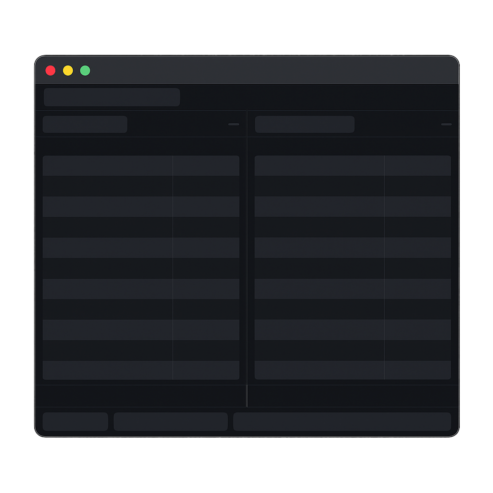

Cross-platform double-panel file manager
===================

Runs on Windows, Linux, and macOS.

Inspired by Total Commander.

Currently is in development — not recommended for use before the first release.

